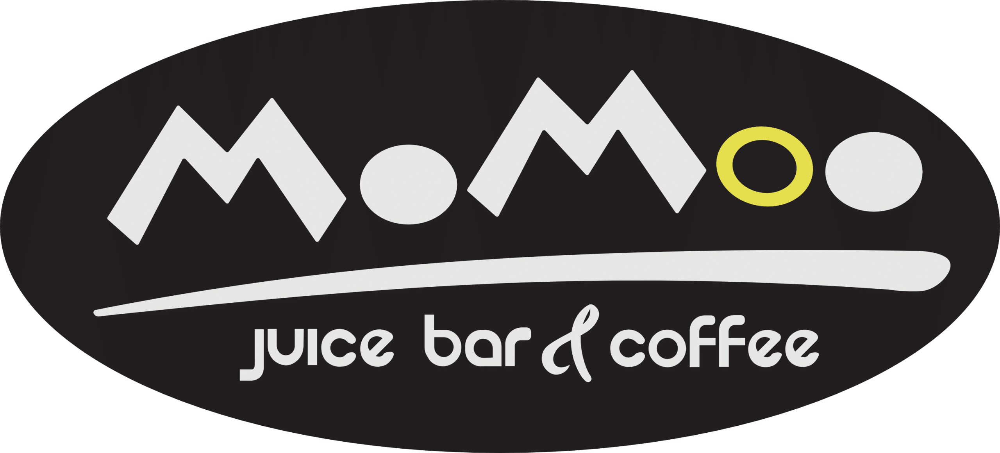
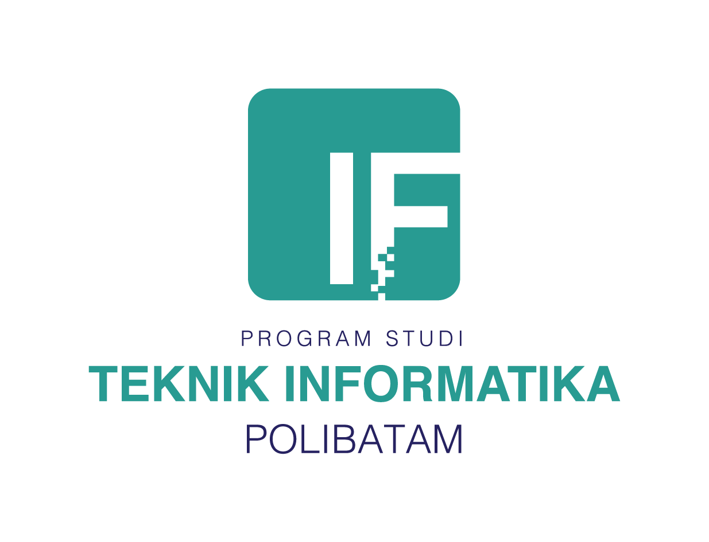

<p align="center">
  
</p>

<h1 align="center">Sistem Pemesanan Menu Cafe Momoo Juice Bar Coffee Windsor Batam</h1>

<p align="center">
  Aplikasi pemesanan berbasis web yang mempermudah proses pemesanan makanan & minuman secara digital — dari pelanggan hingga dapur, kasir, dan pelayan.
</p>

<p align="center">
  
  
  
  
  
</p>

---

## 📖 Deskripsi

**Sistem Pemesanan Cafe Momoo** adalah aplikasi web yang dirancang untuk mendigitalisasi proses pemesanan di cafe secara menyeluruh. Pelanggan dapat melihat menu, menambahkan ke keranjang, checkout, memilih metode pembayaran, dan memantau status pesanan secara real-time.

Pesanan yang masuk diproses oleh dapur, dikonfirmasi kasir, lalu diantarkan pelayan ke meja pelanggan — semua terintegrasi dalam satu sistem.


---

## ✨ Fitur Utama

### 👤 Customer
- Scan QR Code dimeja
- Melihat daftar & detail menu makanan/minuman
- Menambahkan menu ke keranjang
- Menambahkan topping / add-ons
- Checkout & memilih metode pembayaran
- Melihat Struk Digital

### 🛡️ Admin
- Dashboard monitoring lengkap
- CRUD Menu, Kategori, Meja, Add-ons, Metode Pembayaran
- Kelola data user & role
- Monitoring & laporan transaksi
- Export laporan penjualan ke PDF

### 🧾 Kasir
- Melihat daftar pesanan masuk
- Verifikasi & konfirmasi pembayaran
- Mengelola transaksi pembayaran
- Export laporan harian PDF

### 🍳 Dapur
- Melihat pesanan masuk secara langsung
- Memproses & mengupdate status pesanan

### 🛎️ Pelayan
- Melihat daftar pesanan siap antar
- Mengantarkan pesanan ke meja customer
- Menyelesaikan status pesanan

---

## 🔄 Alur Sistem

```text
Customer Memesan Menu
        ↓
  Pesanan Masuk ke Sistem
        ↓
  Kasir Mengonfirmasi Pembayaran
        ↓
  Dapur Memproses Pesanan 
        ↓
  Pelayan Mengantar Pesanan
        ↓
    Pesanan Selesai ✅
```

---

## 🛠️ Teknologi yang Digunakan

| Teknologi | Deskripsi |
|---|---|
| **PHP 8.2** | Bahasa pemrograman utama |
| **Laravel 12** | Framework backend utama |
| **MySQL / MariaDB** | Database relasional |
| **Blade Template** | Template engine bawaan Laravel |
| **Tailwind CSS / Bootstrap** | Styling & komponen UI |
| **JavaScript** | Interaktivitas frontend |
| **Vite** | Build tool frontend |
| **Composer** | Package manager PHP |
| **NPM** | Package manager JavaScript |

---

## 🚀 Instalasi

### 1. Clone Repository

```bash
git clone https://github.com/username/nama-project.git
cd nama-project
```

### 2. Install Dependency PHP

```bash
composer install
```

### 3. Install Dependency Frontend

```bash
npm install
```

### 4. Konfigurasi Environment

```bash
cp .env.example .env
```

Edit file `.env` sesuai konfigurasi database kamu:

```env
DB_CONNECTION=mysql
DB_HOST=127.0.0.1
DB_PORT=3306
DB_DATABASE=tugasakhir
DB_USERNAME=root
DB_PASSWORD=
```

### 5. Generate Application Key

```bash
php artisan key:generate
```

### 6. Jalankan Migration & Seeder

```bash
php artisan migrate
php artisan db:seed
```

### 7. Link Storage

```bash
php artisan storage:link
```

### 8. Build Frontend

```bash
npm run dev
```

### 9. Jalankan Server

```bash
php artisan serve
```

Aplikasi akan berjalan di:

```
http://127.0.0.1:8000
```

---

## 🌐 Akses via Ngrok (Public URL)

Jika ingin diakses dari perangkat lain atau melalui internet:

```bash
ngrok http 8000
```

Gunakan URL Ngrok yang muncul, contoh:

```
https://xxxx-xxxx.ngrok-free.app
```

---

## 👥 Struktur Role User

| Role | Akses |
|---|---|
| 🛡️ **Admin** | Full akses — kelola semua data & laporan |
| 👤 **Customer** | Pesan menu, pantau status, riwayat transaksi |
| 🧾 **Kasir** | Konfirmasi pembayaran & laporan harian |
| 🍳 **Dapur** | Terima & proses pesanan masuk |
| 🛎️ **Pelayan** | Antar pesanan ke meja customer |

---

## 🎯 Tujuan Sistem

- ✅ Mempermudah proses pemesanan secara digital
- ✅ Mengurangi kesalahan pencatatan pesanan
- ✅ Mempercepat alur pelayanan cafe
- ✅ Membantu pengelolaan transaksi secara terpusat
- ✅ Menyediakan laporan penjualan otomatis
- ✅ Meningkatkan efisiensi operasional cafe secara keseluruhan

---

## 👤 Author

| | |
|---|---|
| **Nama** | Faradilla Zahara |
| **NIM** | 3312301012 |
| **Program Studi** | Teknik Informatika |
| **Institusi** | Politeknik Negeri Batam |

---

<p align="center">
  
</p>

<p align="center">
  
  © 2026 Politeknik Negeri Batam — Teknik Informatika
</p>

---

<p align="center">
  <table align="center">
    <tr>
      <td align="center">
        
      </td>
      <td align="center">
        
      </td>
    </tr>
  </table>
</p>